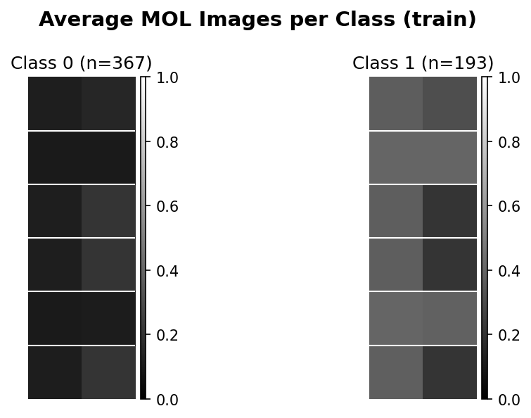

# Attention-Guided Tabular-to-Image Representations

[](https://www.python.org/)
[](https://opensource.org/licenses/MIT)

Transform tabular data into CNN-compatible images using **supervised feature attention** from [TabNet](https://ojs.aaai.org/index.php/AAAI/article/view/16826).

The pipeline is fully decoupled: TabNet learns which features matter, then a deterministic layout maps them to 2D grids, and finally a lightweight CNN classifies the resulting images.



*Example of generated images (average per class) after the attention-guided spatial projection.*

---

## Key Features

- **Task-aware layouts** – attention masks are frozen *after* TabNet training, so the spatial arrangement reflects true predictive importance.
- **Multiple layout strategies** – StepRow, StepSparse, PackedRow, PackedCol, AttentionMap, plus naive and IGTD-inspired baselines.
- **Complete pipeline** – preprocessing, TabNet training, image building, CNN training & evaluation.
- **Interactive dashboard** – a Streamlit app (`app.py`) for visual inspection of attention, layouts, and generated images.
- **Reproducible** – fixed seeds, predefined splits, environment variables for all hyperparameters.
- **Benchmark suite** – compare against XGBoost, LightGBM, CatBoost, FT-Transformer, etc., with extended metrics (balanced accuracy, precision, recall, F1, ROC-AUC).
- **Ready-to-run** – single command to execute the full pipeline.

---

## Project Structure

```text
.
├── api.py                         # Command-line API (run, random, bayesian search)
├── app.py                         # Streamlit interactive dashboard
├── preprocessing/                 # Data cleaning and scaling scripts
├── tabnet_fs/                     # TabNet training and attention extraction
├── image_builder/                 # Tabular-to-image projection (layouts)
├── cnn/                           # CNN model definition, training, evaluation
├── running_all_models/            # Benchmark suite and statistical tests
├── experiments/                   # Generated visualizations & hyperparameter search outputs
├── data/
│   ├── raw/                       # Place raw CSV files here
│   └── processed/                 # Generated after running the pipeline
├── figures/                       # Static figures used in the README / paper
├── requirements.txt               # Python dependencies
└── README.md
```

---

## Installation

```bash
git clone https://github.com/MiguelGoncalvesWork2003/Attention_Guided-Table2Image.git
cd Attention_Guided-Table2Image
pip install -r requirements.txt
```

---

## Quick Start

### 1. Run the full pipeline for a single layout

```bash
python api.py run Cancer --target Class --layout step_row --seed 42
```

This executes:

1. Preprocessing
2. TabNet training
3. Image building (attention-guided layout)
4. CNN training
5. Evaluation (metrics saved to `data/processed/<dataset>/`)
6. Visualization generation (optional)

---

### 2. Launch the interactive dashboard

```bash
streamlit run app.py
```

---

### 3. Run the benchmark (all baselines + AG-T2I variants)

```bash
python running_all_models/benchmark.py
```

Results are saved in:

```text
running_all_models/results/
```

---

### 4. Hyperparameter Search

#### Random Search (parallel)

```bash
python api.py random Cancer --target Class --trials 50 --jobs 4
```

#### Bayesian Optimization

```bash
python api.py bayesian Cancer --target Class --trials 50
```

---

## Datasets

Place the raw CSV files in:

```text
data/raw/
```

The script expects the same file names as in the benchmark configuration, for example:

- Cancer.csv
- Diabetes.csv
- Glass.csv
- Thyroid.csv
- Card.csv

Each file should contain a target column (e.g., `Class`, `Outcome`, etc.).

You can adjust column names in the benchmark script or explicitly specify the target using:

```bash
--target <column_name>
```

---

## Reproducing the Paper Results

The paper:

> **Attention-Guided Tabular-to-Image Representations for Deep Learning**

is available in the repository root as:

```text
Article__Attention_Guided_Tabular_to_Image_Representations_for_Deep_Learning.pdf
```

### Run the benchmark on all datasets

```bash
cd running_all_models
python benchmark.py
```

### Statistical analyses

Paired t-tests, Wilcoxon signed-rank tests, and Friedman + Nemenyi comparisons:

```bash
python statistical_tests.py
```

All hyperparameters, seeds, and configurations are recorded in the output files.

---

## Citation

If you use this code or build upon the ideas in our paper, please cite:

```bibtex
@article{bourgingoncalves2025attention,
  title={Attention-Guided Tabular-to-Image Representations for Deep Learning},
  author={Bourgin Gon{\c{c}}alves, Miguel and Dutra, In{\^e}s},
  journal={Preprint (under review)},
  year={2025},
  note={Available at https://github.com/MiguelGoncalvesWork2003/Attention_Guided-Table2Image}
}
```

---

## License

This project is licensed under the **MIT License**. See the `LICENSE` file for details.